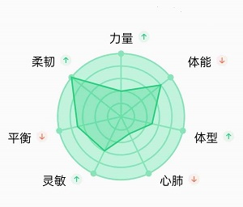

## 该项目记录了在开发过程中的自定义View

### 图表

#### 1. CircleChart


使用方法：
```
        CircleChart circleChart = findViewById(R.id.circleChart);
        CircleChart.CircleBean[] circleBeans = new CircleChart.CircleBean[4];
        circleBeans[0] = new CircleChart.CircleBean(Color.parseColor("#FF38D7D5"), 0.3f);
        circleBeans[1] = new CircleChart.CircleBean(Color.parseColor("#FF2AD181"), 0.2f);
        circleBeans[2] = new CircleChart.CircleBean(Color.parseColor("#FFFF9125"), 0.25f);
        circleBeans[3] = new CircleChart.CircleBean(Color.parseColor("#FFFFD547"), 0.25f);
        circleChart.setData(circleBeans);
```

#### 2. clockchart


使用方法：
```
        ClockChart clockChart = findViewById(R.id.clockChart);
        ClockChart.ClockBean clockBean = new ClockChart.ClockBean();
        clockBean.score = 100;
        clockBean.lastScore = 40;
        clockBean.level = "优秀";
        clockBean.date = "8月23日 18:00";
        clockBean.userPercent = "超越了56%的用户";
        clockChart.setData(clockBean);
```

#### 3. pbchart


使用方法：
```
        ProgressBarChart progressBarChart = findViewById(R.id.progressBarChart);
        progressBarChart.setMaxProgress(10);
        progressBarChart.setProgress(160F);
        String[] progressText = new String[]{"59", "81", "168", "198"};
        ProgressBarChart.ProgressBarBean progressBarBean = new ProgressBarChart.ProgressBarBean(setProgressChart(), progressText);
        progressBarChart.setData(progressBarBean);
```


#### 4. radarchart



使用方法：
```
        RadarChart radarChart = findViewById(R.id.radarChart);
        List<RadarChart.Indicate> indicateList = new ArrayList<>();
        indicateList.add(new RadarChart.Indicate("力量", 0.4F, true));
        indicateList.add(new RadarChart.Indicate("体能", 0.8F, false));
        indicateList.add(new RadarChart.Indicate("体型", 0.5F, true));
        indicateList.add(new RadarChart.Indicate("心肺", 0.3F, false));
        indicateList.add(new RadarChart.Indicate("灵敏", 0.6F, true));
        indicateList.add(new RadarChart.Indicate("平衡", 0.7F, false));
        indicateList.add(new RadarChart.Indicate("柔韧", 1F, true));
        radarChart.setData(indicateList);
```

### 动效

 #### 1. PickView
 > 规则的选择View，点击会有动画效果，可以控制选中子View的数量。

 


 #### 2. AnimView
> 一个数字切换的动效。


 